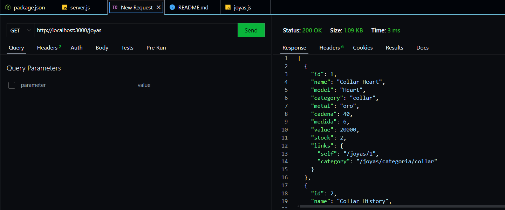
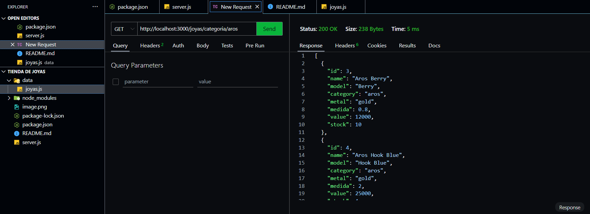
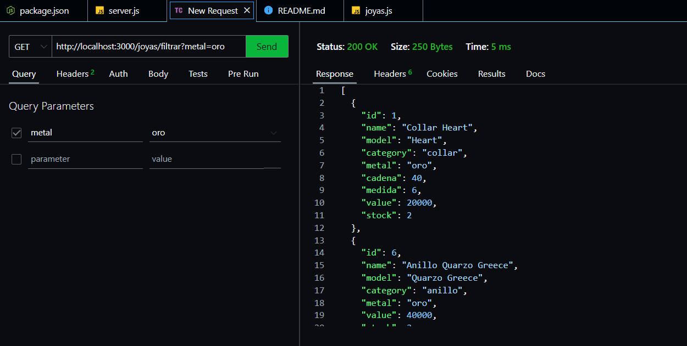
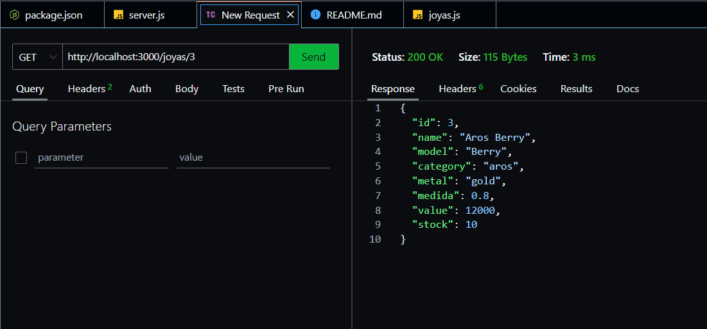

## Rutas de la API de Joyas

- **GET /joyas**: Devuelve la estructura HATEOAS de todas las joyas almacenadas.
GET http://localhost:3000/joyas

- **GET /joyas/categoria/:categoria**: Devuelve las joyas de una categoría específica.
GET http://localhost:3000/joyas/categoria/aros

- **GET /joyas/filtrar**: Permite filtrar las joyas por campos como metal, cadena, etc.
GET http://localhost:3000/joyas/filtrar?metal=oro

- **GET /joyas/:id**: Busca una joya por su ID y devuelve un mensaje de error si no se encuentra.
GET http://localhost:3000/joyas/3

- **GET /joyas/paginacion**: Permite la paginación de las joyas.

- **GET /joyas/ordenar**: Permite ordenar las joyas por valor ascendente o descendente.
